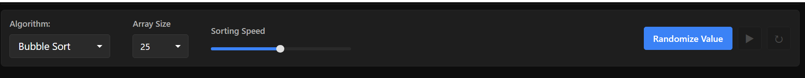

# SortScope — Interactive Sorting Algorithm Visualizer

SortScope is an interactive web application that visualizes sorting algorithms in real time. It helps understand how sorting algorithms work internally through animated bars, live statistics, and algorithm insights.

---

## Features

### Visualization
- Real-time sorting animation
- Dynamic bar rendering
- Color-coded comparison and swap highlights

### Controls
- Adjustable array size
- Speed control slider
- Algorithm selector
- Random array generator
- Play, pause, and reset controls

### Metrics
- Comparison counter
- Swap counter
- Step tracker
- Time and space complexity display

---

## Screenshots

### Visualization

### Controls

---

## Purpose

This project was built to make algorithm learning intuitive through visualization. Instead of reading static pseudocode, users can observe how algorithms compare values, perform swaps, and gradually reach a sorted result.

---

## Supported Algorithms

- Bubble Sort
- Insertion Sort
- Selection Sort

---

## Roadmap

- Merge Sort
- Quick Sort
- Heap Sort
- Algorithm comparison mode
- Sound feedback
- Dark/light theme toggle
- Mobile responsiveness

---

## Tech Stack

- React
- Vite
- Ant Design
- Ant Design Plots

---

## Contributing

Contributions are welcome. Fork the repository, create a feature branch, commit changes, and open a pull request.

---

## License

This project is licensed under the MIT License.
