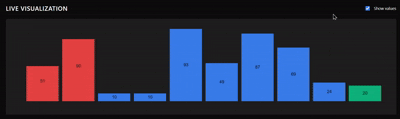
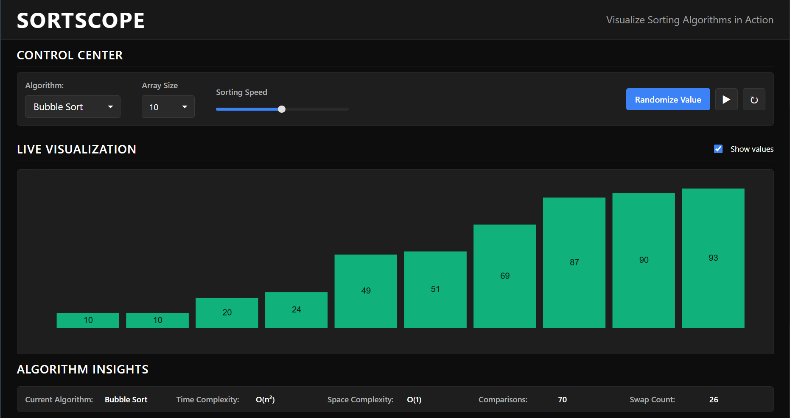
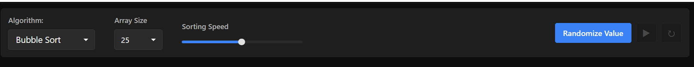

  <h1>SortScope — Interactive Sorting Algorithm Visualizer</h1>
  
Interactive, real-time animations and insights to understand how sorting works.

  

    
  

---

## Purpose

This project was built to make algorithm learning intuitive through visualization. Instead of reading static pseudocode, users can observe how algorithms compare values, perform swaps, and gradually reach a sorted result.

---

## Features

### Visualization
- Real-time sorting animation
- Dynamic bar rendering
- Color-coded comparison and swap highlights

### Controls
- Adjustable array size
- Speed control slider
- Algorithm selector
- Random array generator
- Play, pause, and reset controls

### Metrics
- Comparison counter
- Swap counter
- Step tracker
- Time and space complexity display

---

## Screenshots

### Visualization

  

### Controls

  

---

## Supported Algorithms

- Bubble Sort
- Insertion Sort
- Selection Sort
- Cocktail Sort
- Comb Sort
- Shell Sort

